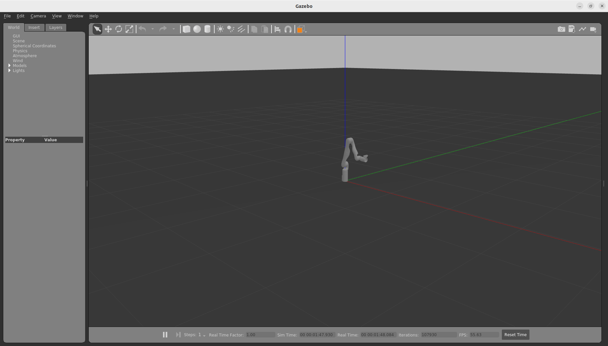
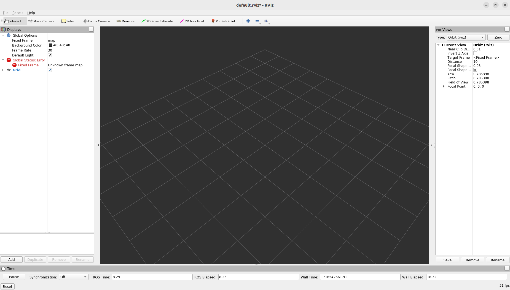
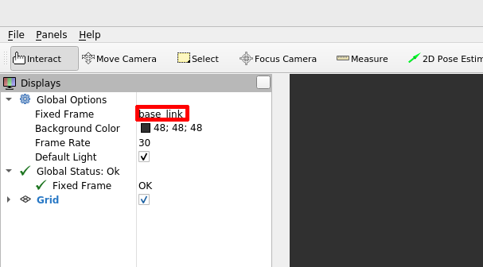
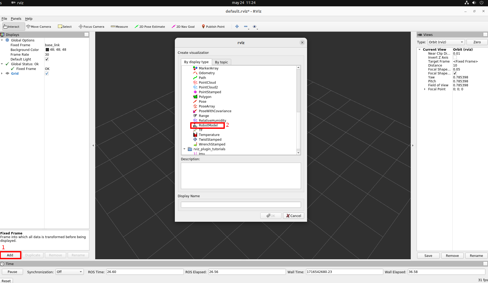
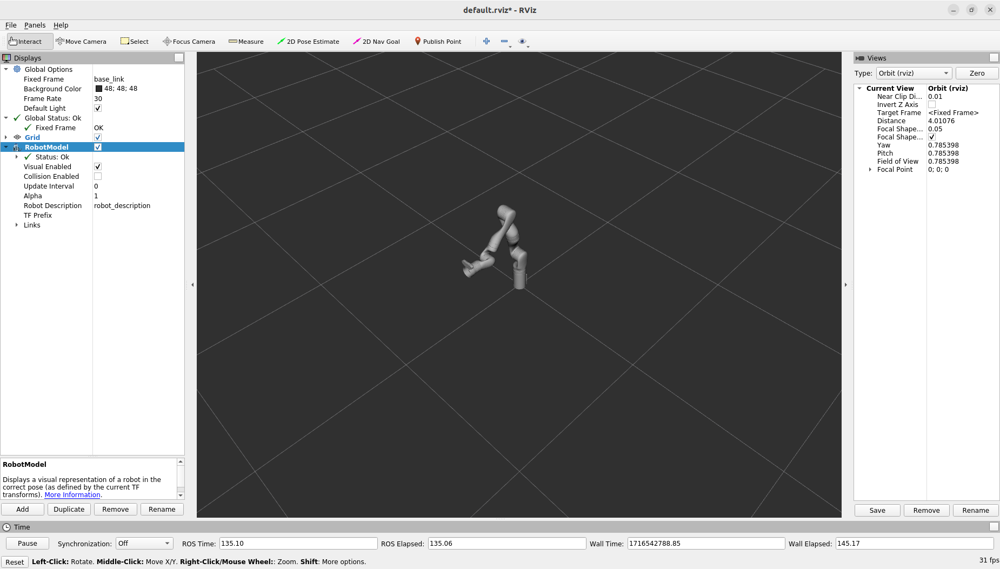
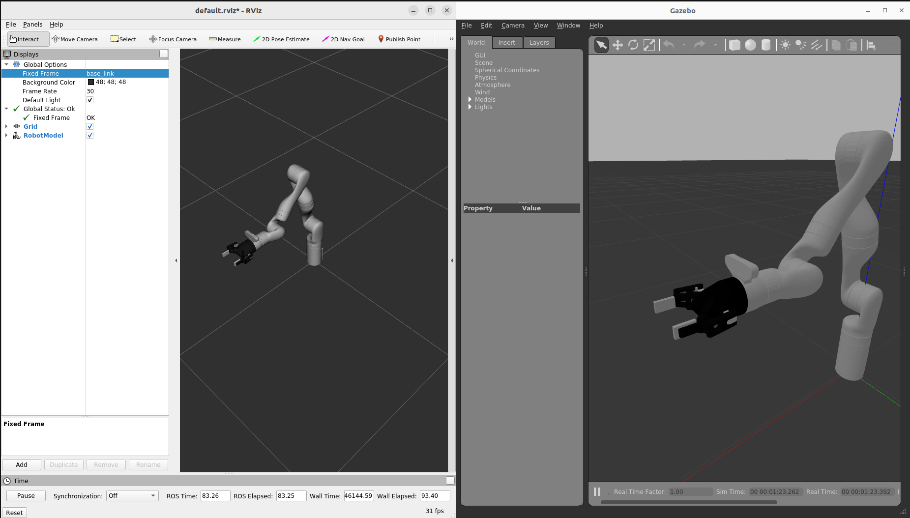

Kinova Robot Docker (KortexAPI v2.6.0 || ROS Noetic - Ubuntu 20.04)
=============================
[[_TOC_]]

----------------------------------

## 1. Install docker

- Install Docker Engine:

https://docs.docker.com/engine/install/ubuntu/
<br/><br/>
- If your computer has a NVIDIA GPU, install **nvidia-docker 2.0** to use Hardware Acceleration, otherwise you can skip this step:

https://docs.nvidia.com/datacenter/cloud-native/container-toolkit/install-guide.html#docker
<br/><br/>
- Enable docker run without need of *sudo* privileges:

```
sudo groupadd docker
sudo usermod -aG docker ${USER}
su - ${USER}  //or log out and log in
sudo systemctl restart docker
```


## 2. Build the docker image
In order to run the robot in a simulation environment a Dockerfile is delivered with this repository. To build the Docker container execute the *build_docker.sh* script: 

```
sh build_docker.sh
```

**NOTE**: This procedure may take several minutes.
- Now, the image should appear in your docker images list:

```
docker images
```

The output should be something like the following result:

```
REPOSITORY     TAG         IMAGE ID       CREATED        SIZE
kinova_docker  latest      ############   # minutes ago  #.##GB

```

## 3. Run docker container

- Create a shared folder in the local machine
```
mkdir ~/shared
```

- To run the Docker container execute the *run_docker.sh* script:
```
xhost + 
sh run_docker.sh
```

## 4. Docker usage

- To start the container again, assuming it's the **last container used**, for the first terminal, run the following command:

```
xhost +
docker start -a -i `docker ps -ql`
```

Then, to open new terminals on the same container:

```
docker exec -it `docker ps -ql` /bin/bash
```
*Note: Instead of \``docker ps -ql`\`  you can use a specific CONTAINER ID or NAME. Inspect them with `docker container list -a`*

- You can share files in the **~/shared** directory *(**/shared** in the container)*
<br/><br/>
- To delete a docker image:

```
docker rmi <IMAGE_ID>
```
*Note: You can use `docker images` to list all the images*
<br/><br/>

- To delete a docker container:

```
docker rm <CONTAINER_ID_or_NAME>
```
*Note: You can use `docker container list -a` or `docker ps -a` to list all the containers*
<br/><br/>

- To close the docker, run the following command:

```
exit
```

## 5. Simulation
> :warning: To avoid unsafe behavior, when working with the Kinova simulation, keep the real robot switched off.

> :book: You have all the official documentation of the simulation in the [Kortex Gazebo section](https://github.com/Kinovarobotics/ros_kortex/blob/noetic-devel/kortex_gazebo/readme.md). 

- On a **docker** terminal, execute the following command to launch the simulation of the robot:
```
roslaunch kortex_gazebo spawn_kortex_robot.launch
```
- If the RVIZ and Gazebo windows do not open, please stop the execution with `CTRL+C` and then type `exit` to quit the docker. In the terminal outside the docker type `xhost +` and re-enter the docker with `docker exec -it CONTAINER_NAME /bin/bash`.
- If the execution is successful, two windows (Rviz and Gazebo) will be opened:



-  To display the robot correctly in RVIZ, follow these steps:
   1. Select `base_link` as **fixed frame**:


   2. Click on the `Add` button and select `RobotModel`:


   3. Now you can see the 3D model of the Kinova robot in the RVIZ window:


### Robotiq gripper in simulation
- If you want to add the gripper to the robot simulation, it is necessary that when you launch the kortex_gazebo you add the argument `gripper:=robotiq_2f_85`:
```
roslaunch kortex_gazebo spawn_kortex_robot.launch gripper:=robotiq_2f_85
```



### ROS Topics
- Once we have launched the simulation, to see the ROS topics we need to open a new docker terminal with `docker exec -it CONTAINER_NAME /bin/bash` and then execute the following command:
```
rostopic list
```

- And now, for example, you can obtain the joints position by subscribing to the following topic:
```
rostopic echo /my_gen3/joint_states


---
header: 
  seq: 2451
  stamp: 
    secs: 49
    nsecs:  42000000
  frame_id: ''
name: 
  - finger_joint
  - joint_1
  - joint_2
  - joint_3
  - joint_4
  - joint_5
  - joint_6
  - joint_7
position: [2.7739339119037254e-06, 7.959895651055149e-06, 0.2602091782682425, 3.140041887892177, -2.2701172467911412, -1.3674916354844413e-06, 0.9596580082350652, 1.5700176814875695]
velocity: [-0.0011234652069479312, -0.002629387685663766, -0.00025710410781573634, 0.001968289525067711, -0.00012532405430484104, 3.157486911954015e-05, -1.4059569747974279e-05, 0.0007902447200522124]
effort: [-1.8432207449237126e-05, -0.03253611495809555, -10.47145110297798, -0.11950896500145802, 5.85857637103171, 0.001027246927852079, 1.7096576808980077, -0.0016849612388014634]
---

```
